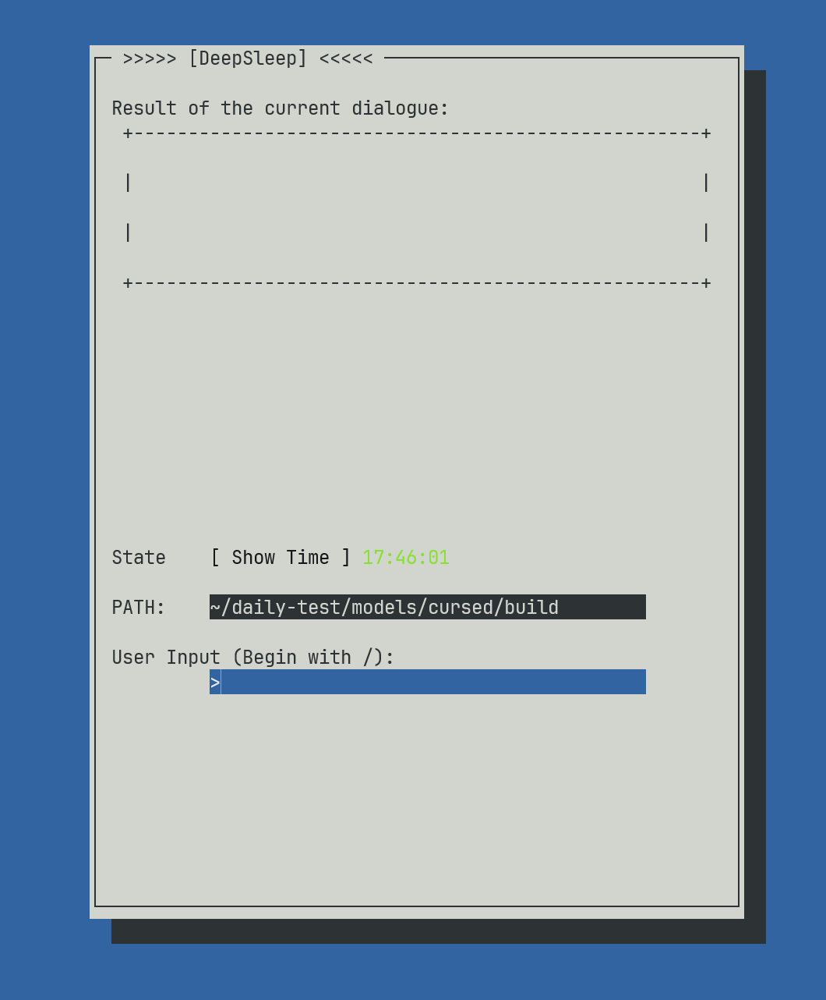

# C++ TUI simulating an AI agent CLI

## About this project

Address:[github.com/z14212638-eng/Daily-exam/tree/master](https://github.com/z14212638-eng/Daily-exam/tree/master)

> This project is tend to use C++ TUI with cursed. According to the requirement of Dian Group, I would list the function that has been implemented in 2026.7.10.

### UI Configuration

I took a view on Github and find the origin project called cursed.

The author provide a wrapped module for us to build a window using cursed in TUI. However, it is rather simple and inorganized.

So I took a few steps to polish and organize the whole project.



### Feature

1. Base TUI presented in terminal.
2. User-Interactive input Box.
3. Current work directory and Real Time presentation.
4. Multiple commands:  like /history, /exit
5. clean the input box before next operation.

### Build&Install

```Shell
cd cursed
mkdir build
cd build
cmake ..
make 
./agent
```
